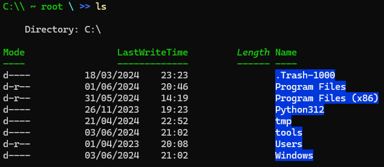
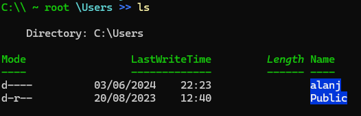
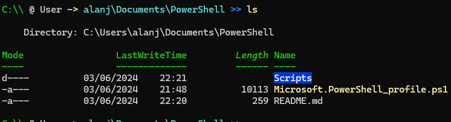
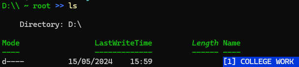
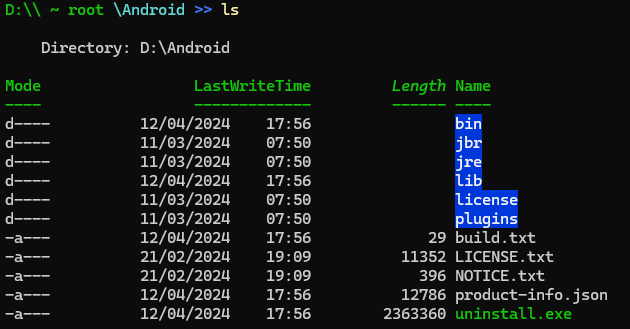

# Powershell Profile - Alan Byrne

## A simple powershell profile project which tries to mimic Linux's BASH ease of use.

#### *NOTE*: Some aliases are used within provided scripts, and should <u>**NOT**</u> be removed.

## C Drive:

...

...

## Other Drives:

...

